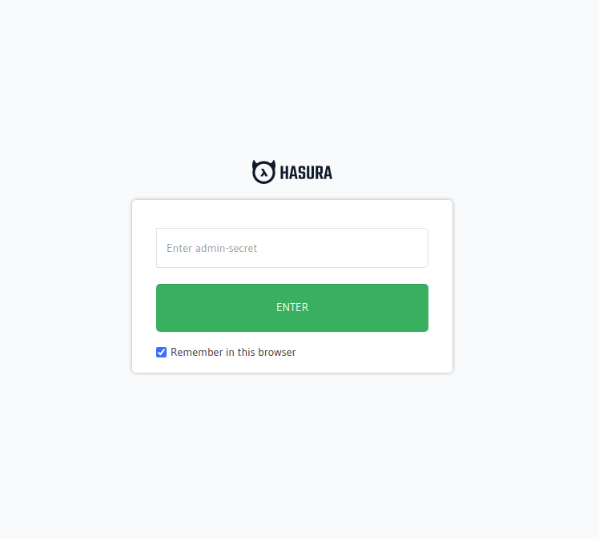
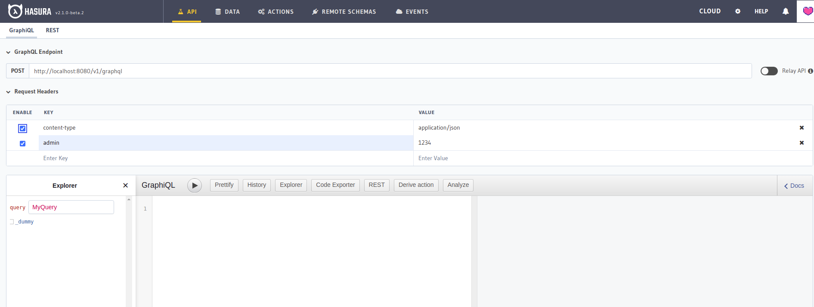

Application templates for Laravel and Symfony, these had been config needed settings for you like
[local remote schema](https://hasura.io/docs/latest/graphql/core/remote-schemas/index.html), [handle event triggered by Hasura](https://hasura.io/docs/latest/graphql/core/event-triggers/index.html), structured Hasura metadata,
Sailor graphql client code generator, authentication hook, Sanctum/JWT authentication, and Helm chart help you easy to deploy your project to Kubernetes.

## Initial project

If you are Github user, you can generate new repo base on templates or download `tar` file on Github releases pages of us.

### Generate Github repo

+ [Laravel app](https://github.com/hasura-extra/laravel-app/generate)
+ [Symfony app](https://github.com/hasura-extra/symfony-app/generate)

### Download `tar` file on Github releases pages

+ [Laravel app](https://github.com/hasura-extra/laravel-app/releases)
+ [Symfony app](https://github.com/hasura-extra/symfony-app/releases)

## Setup after init

After init project you run a command bellow to config needed settings for your project:

```shell
docker-compose pull
docker-compose run --rm setup
```

:::info
You only need to run it at the first time.
:::

Then run another container services in detached mode:

```shell
docker-compose up -d
```

Done, now you can start to build your project.

## Container services

After init and run setup, you should have container services bellow:

Name | Protocol | Container ports | Published ports | Desc
--- | -------- | --------------- | --------------- | -----
apache | http  | 80 | 80 | -
postgres | tcp | 5432 | 5432 | -
hasura | http | 8080 | 8080 | -
mailhog | http/smtp | 8025,1025 | 8025 | Server mail mock for testing purpose

You can access your Hasura graphql engine via url: [http://localhost:8080](http://localhost:8080)



Admin secret is `1234`, you can change it and take a look another settings in
`docker-compose.yaml` file (when you change environment settings, you need to restart container services).


