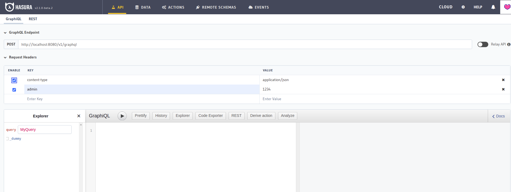

Đây là 2 bộ application template (boilerplate) dành riêng cho Laravel và Symfony được cài đặt sẵn các
cấu hình cần thiết cho việc integrate giữa framework và Hasura như local [remote schema](https://hasura.io/docs/latest/graphql/core/remote-schemas/index.html),
handle [event triggered](https://hasura.io/docs/latest/graphql/core/event-triggers/index.html) bởi Hasura, tổ chức sắp xếp Hasura metadata,
Sailor graphql client code generator, authentication hook, Sanctum/JWT authentication, Helm chart dùng để deploy dự án của bạn lên Kubernetes và có example giúp bạn dễ tiếp cận hơn.


## Khởi tạo project

Bạn có thể generate một app repo mới hoặc tải file nén tại Github releases mà chúng tôi cung cấp theo link bên dưới.

### Generate app repo mới tại Github

+ [Laravel app](https://github.com/hasura-extra/laravel-app/generate)
+ [Symfony app](https://github.com/hasura-extra/symfony-app/generate)

### Tải file nén tại Github releases

+ [Laravel app](https://github.com/hasura-extra/laravel-app/releases)
+ [Symfony app](https://github.com/hasura-extra/symfony-app/releases)

## Setup sau khi khởi tạo

Sau khi khởi tạo bạn hãy chạy câu lệnh sau để setup mọi thứ cần thiết cho project của bạn:

```shell
docker-compose run --rm setup
```

:::info
Bạn chỉ cần chạy câu lệnh này 1 lần duy nhất, các lần sau không cần chạy.
:::

Tiếp đến là gọi các container services dậy ở mode detached:

```shell
docker-compose up -d
```

Thế là xong, bạn đã có thể bắt đầu xây dựng project được rồi đấy.

## Container services

Sau khi khởi tạo và run setup, bạn sẽ có các services sau:

Tên | Protocol | Container ports | Published ports | Mô tả
--- | -------- | --------------- | --------------- | -----
apache | http  | 80 | 80 | -
postgres | tcp | 5432 | 5432 | -
hasura | http | 8080 | 8080 | -
mailhog | http/smtp | 8025,1025 | 8025 | Server mail mock, để test send mail

Bây giờ bạn hãy truy cập vào Hasura theo URL: [http://localhost:8080](http://localhost:8080) Hasura sẽ đòi hỏi bạn điền
admin secret trong lần đăng nhập đầu tiên, ở các lần sau Hasura sẽ không hỏi lại:


Admin secret là `1234`, bạn có thể thay đổi và tìm hiểu thêm các cấu hình khác trong file
`docker-compose.yaml` (lưu ý: khi thay đổi bạn cần restart lại container service).


