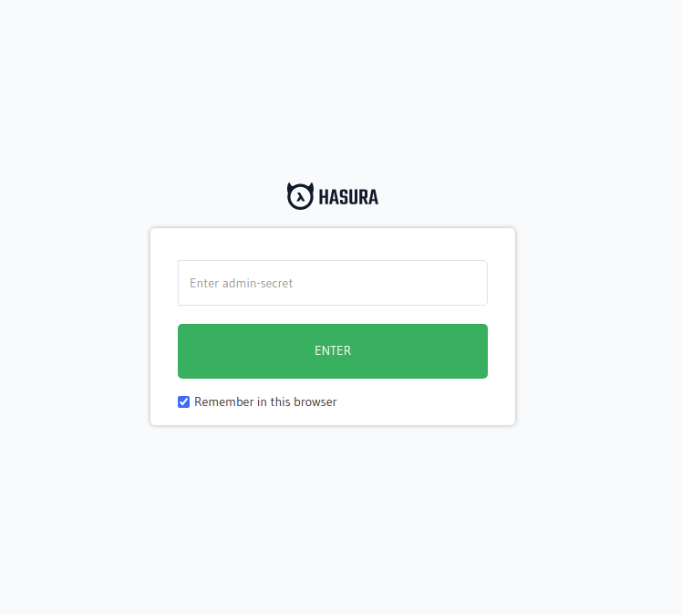
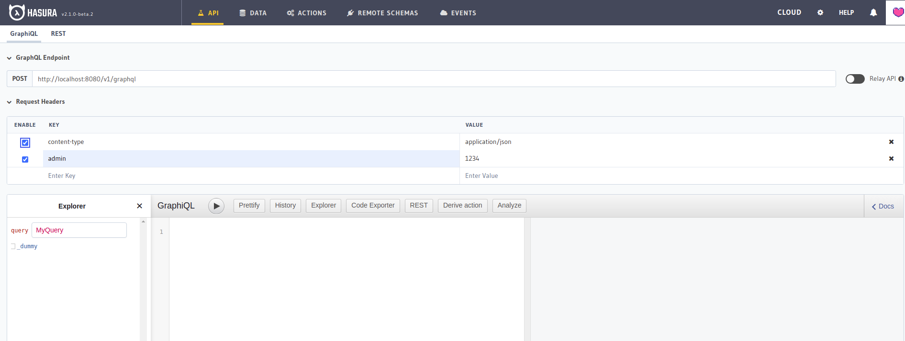

## Khởi tạo project

Bạn có thể [generate một repo mới](https://github.com/hasura-extra/symfony-app/generate) dựa trên template mà chúng tôi cung cấp hoặc
tải file nén tại [Github releases](https://github.com/hasura-extra/symfony-app/releases).

## Setup sau khi khởi tạo

Sau khi khởi tạo bạn hãy chạy câu lệnh sau để setup mọi thứ cần thiết cho project của bạn:

```shell
docker-compose run --rm setup
```

:::info
Bạn chỉ cần chạy câu lệnh này 1 lần duy nhất, các lần sau không cần chạy.
:::

Tiếp đến là gọi các container services dậy ở mode detached:

```shell
docker-compose up -d
```

Thế là xong, bạn đã có thể bắt đầu xây dựng project được rồi đấy.

## Container services

Sau khi khởi tạo và run setup, bạn sẽ có các services sau:

Tên | Protocol | Container ports | Published ports | Mô tả
--- | -------- | --------------- | --------------- | -----
apache | http  | 80 | 80 | -
postgres | tcp | 5432 | 5432 | -
hasura | http | 8080 | 8080 | -
mailhog | http/smtp | 8025,1025 | 8025 | Server mail mock, để test send mail 

Bây giờ bạn hãy truy cập vào Hasura theo URL: http://localhost:8080 Hasura sẽ đòi hỏi bạn điền
admin secret trong lần đăng nhập đầu tiên, ở các lần sau Hasura sẽ không hỏi lại:




Admin secret là `1234`, bạn có thể thay đổi và tìm hiểu thêm các cấu hình khác trong file 
`docker-compose.yaml` (lưu ý: khi thay đổi bạn cần restart lại container service). 



Đăng nhập xong, kết thúc quá trình cài đặt với Symfony App.