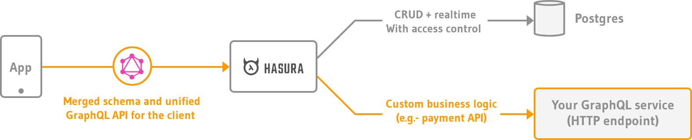

Hasura giúp chúng ta rất nhiều trong vấn đề CRUD, realtime websocket và authorization, tuy nhiên nó không thể giúp chúng ta handle business
logic vì mỗi dự án sẽ có các đặc thù riêng (ví dụ: validation data, gọi 3rd parties API...).
Chính vì lý do đó chúng ta cần xây dựng [remote schema](https://hasura.io/docs/latest/graphql/core/remote-schemas/index.html) để handle.

Hasura Extra tích hợp với [GraphQLite](https://graphqlite.thecodingmachine.io/docs) để xây dựng [GraphQL server](./02-graphql-server/01-graphqlite.md) handle business logic.

Mô phỏng (nguồn [Hasura](https://hasura.io)):

:::tip
Nếu như project của bạn bắt đầu từ [Laravel hoặc Symfony application template](../02-installation/02-application-templates.md) thì bạn có thể bỏ qua tài liệu này vì mặc định
chúng tôi đã thêm sẵn giúp bạn.
:::

## Thêm remote schema

Để handle business logic bạn cần thêm remote schema trỏ về GraphQL server ([GraphQLite](./02-graphql-server/01-graphqlite.md)) url path sẽ là `/graphql`,
xem hướng dẫn tại [đây](https://hasura.io/docs/latest/graphql/core/remote-schemas/adding-schema.html).

## Cấu hình remote schema name

Sau khi thêm remote schema ở bước trên bạn cần cấu hình remote schema name cho project của bạn:

+ Đối với Laravel package bạn cần cấu hình `remote_schema_name` tại `config/hasura.php`.
+ Đối với Symfony bundle bạn cần cấu hình `hasura.remote_schema_name` tại `config/packages/hasura.yaml`.