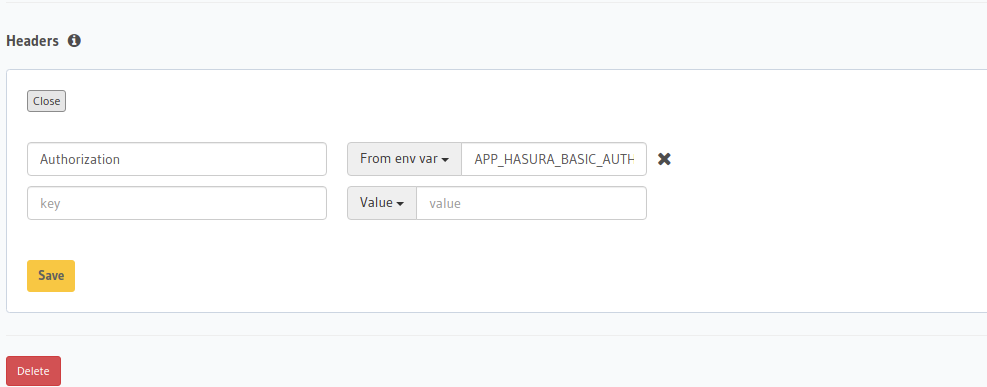

Hasura Extra sẽ dispatch [table events triggered](https://hasura.io/docs/latest/graphql/core/event-triggers/index.html) bởi Hasura 
thông qua [PSR-14](https://www.php-fig.org/psr/psr-14/) event dispatcher.

Mặc định khi cài Symfony bundle url path để handle table event sẽ là `/hasura_table_event` bạn sẽ cần url path này ở bước [thêm event trigger](#add-event-trigger).

## Thêm event trigger tại Hasura {#add-event-trigger}

Đầu tiên bạn cần thêm event trigger trên Hasura xem hướng dẫn tại [đây](https://hasura.io/docs/latest/graphql/core/event-triggers/create-trigger.html).

:::tip
Nếu như bạn sử dụng [Symfony App](../02-installation/03-symfony-app.md) thì hãy sử dụng value `{{APP_BASE_URI}}/hasura_table_event` làm 
webhook url mỗi khi thêm event trigger.
:::

## Dành cho Symfony users

[Event Dispatcher](https://symfony.com/doc/current/event_dispatcher.html) của Symfony cũng implements **PSR-14** nên việc handle event của Hasura sẽ không khác gì với các system event mà bạn hay handle
(ví dụ `kernel.request`). Mỗi khi Hasura trigger table event, dispatcher sẽ dispatch event `Hasura\EventDispatcher\TableEvent`, bạn
chỉ cần subscribe/listen sự kiện trên để chèn business logic, ví dụ:

```php
namespace App\EventSubscriber\Hasura;

use Symfony\Component\DependencyInjection\ParameterBag\ParameterBagInterface;
use Symfony\Component\EventDispatcher\EventSubscriberInterface;
use Hasura\EventDispatcher\TableEvent;
use Symfony\Component\Mailer\MailerInterface;
use Symfony\Component\Mime\Email;

final class WelcomeUserRegisteredSubscriber implements EventSubscriberInterface
{
    private string $appName;

    private string $emailSender;

    public function __construct(ParameterBagInterface $bag, private MailerInterface $mailer)
    {
        $this->appName = $bag->get('app.name');
        $this->emailSender = $bag->get('app.email_sender');
    }

    public static function getSubscribedEvents()
    {
        return [
            TableEvent::class => 'onTableEvent',
        ];
    }

    public function onTableEvent(TableEvent $event)
    {
        if ('user_registered' !== $event->getTriggerName()) {
            return;
        }

        # Discovery payload: https://hasura.io/docs/latest/graphql/core/event-triggers/payload.html#json-payload
        $event = $event->getEvent();
        $eventData = $event['data']['new'];

        $welcomeEmail = new Email();
        $welcomeEmail->from($this->emailSender);
        $welcomeEmail->to($eventData['email']);
        $welcomeEmail->subject($this->appName);
        $welcomeEmail->html(sprintf('<h1>Hi %s, welcome to %s</h1>', $eventData['name'], $this->appName));

        $this->mailer->send($welcomeEmail);
    }
}
```

Như ví dụ trên, với event trigger tên là `user_registered` được tạo ở [bước đầu tiên](#add-event-trigger), mỗi khi user registered (inserted) Hasura
sẽ trigger webhook đến url path: `/hasura_table_event` và từ đó dispatcher sẽ dispatch sự kiện `Hasura\EventDispatcher\TableEvent`, subscriber
sẽ gửi mail welcome đến end-user.

### Security config

:::info
Nếu như project của bạn sử dụng [Symfony App](../02-installation/03-symfony-app.md), template đã config sẵn giúp bạn, bạn
không cần làm theo tài liệu bên dưới.
:::

Như bạn thấy route path: `/hasura_table_event` bất kỳ ai cũng có thể send request đến nó, bạn cần phải cấu hình security
cho nó để cho chỉ có Hasura mới có thể request đến route path này, có rất nhiều cách để cấu hình, trong tài liệu này chúng ta
sẽ sử dụng basic authentication để xác minh request đến từ Hasura.

Cấu hình [basic authentication](https://symfony.com/doc/current/security.html#http-basic) 
với [memory user provider](https://symfony.com/doc/current/security/user_providers.html#security-memory-user-provider) 
để xác minh request đến từ Hasura:

```yaml
security:
    enable_authenticator_manager: true
    password_hashers:
        Symfony\Component\Security\Core\User\InMemoryUser: 'plaintext'
    providers:
        ...
        hasura:
            memory:
                users:
                    hasura: { password: '%env(APP_HASURA_SECRET)%' }
    firewalls:
        ...
        table_event:
            pattern: ^/hasura_table_event$
            stateless: true
            provider: hasura
            http_basic:
                realm: Hasura Area
    access_control:
         ...
         - { path: ^/hasura_table_event$, roles: IS_AUTHENTICATED_FULLY }

```

Sau đó khi bạn [thêm event trigger tại Hasura](#add-event-trigger), bạn cần thêm basic auth header:



Vậy là bạn đã config xong basic authentication rồi đấy, lưu ý theo ví dụ trên bạn cần config `APP_HASURA_SECRET` trong `.env` của application,
và `APP_HASURA_BASIC_AUTH` env của `hasura` service container.