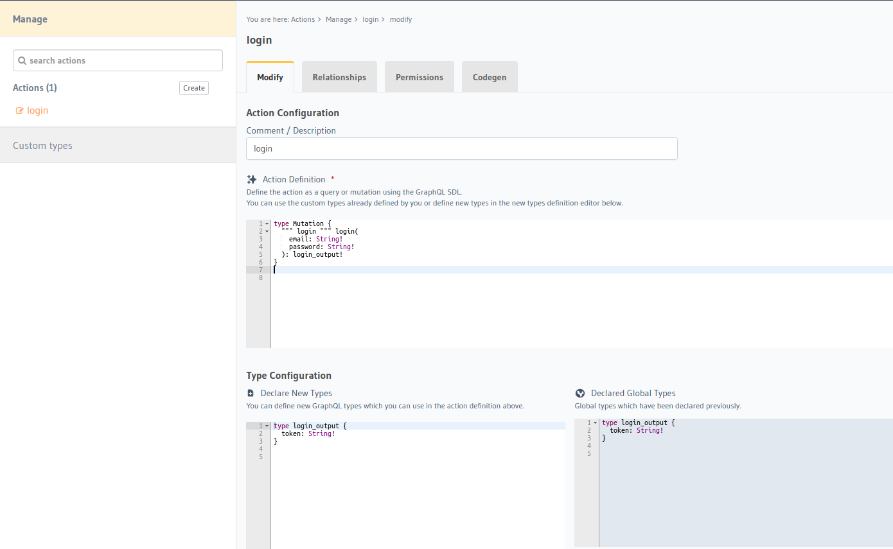
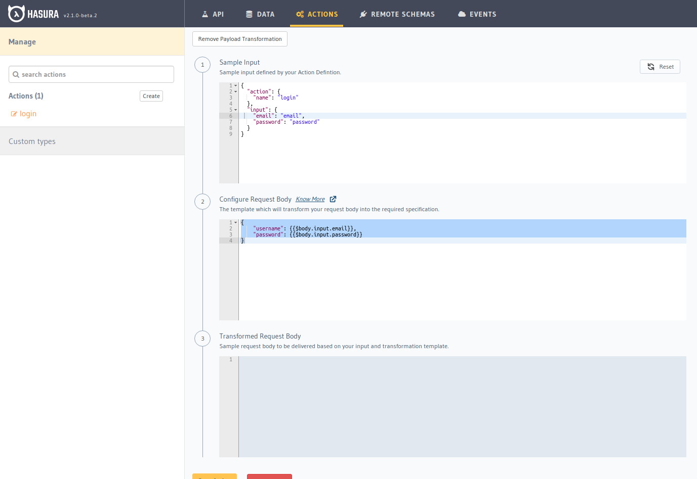
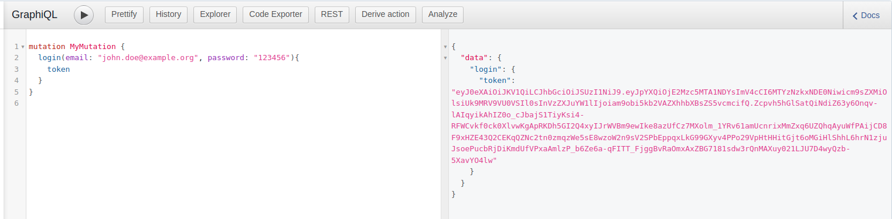

:::caution
Tài liệu này chỉ dành cho Symfony users sử dụng [webhook mode](./01-config-webhook.md).
:::

:::info
Nếu như project của bạn sử dụng [Symfony App](../02-installation/03-symfony-app.md), template đã setup mọi thứ giúp bạn,
bạn không cần làm theo các bước bên dưới mà chỉ nên đọc để hiểu cơ chế hoạt động của nó như thế nào.
:::

Hasura Extra webhook mode có thể dễ dàng tích hợp [JWT](https://jwt.io) authentication thông qua [Lexik JWT authentication bundle](https://github.com/lexik/LexikJWTAuthenticationBundle)
và [Hasura action](https://hasura.io/docs/latest/graphql/core/actions/index.html).

## Cài đặt Lexik JWT authentication

Cài đặt thông qua Composer:

```shell
composer require jwt
```

Sau khi cài xong bạn cần khởi tạo set public/private keys thông qua [command được cung cấp bởi bundle](https://github.com/lexik/LexikJWTAuthenticationBundle/blob/2.x/Resources/doc/index.md#generate-the-ssl-keys):

```shell
php bin/console lexik:jwt:generate-keypair
```

public/private keys sẽ được sinh ra trong thư mục `config/jwt`.

## Cấu hình security bundle

Bạn cần cấu hình security main firewall (`config/packages/security.yaml`) cho webhook endpoint và [GraphQLite](../03-handle-business-logic/02-graphqlite.md) endpoint,
ví dụ:

```yaml
security:
    enable_authenticator_manager: true
    providers:
        user:
            entity:
                class: App\Entity\User
                property: email
    firewalls:
        main:
            stateless: true
            provider: user
            # https://github.com/lexik/LexikJWTAuthenticationBundle/blob/2.x/Resources/doc/index.md#configuration
            jwt: ~
            json_login:
                check_path: /login
                success_handler: lexik_jwt_authentication.handler.authentication_success
                failure_handler: lexik_jwt_authentication.handler.authentication_failure
            entry_point: jwt
```

Theo ví dụ trên tất cả request đi vào system của bạn đều được security bundle authenticate, tiếp đến bạn cần add route mock `/login`,
khởi tạo file `config/routes/login.yaml` với nội dung sau:

```yaml
login:
  path: /login
  methods: [POST]
```

Như bạn thấy route trên không có controller, mục đích chỉ để định danh cho `json_login` ở trên.

## Listen authentication failure event

Bạn cần tạo một subscriber/listener để listen authentication failure event nhằm [format response payload theo yêu cầu của Hasura action](https://hasura.io/docs/latest/graphql/core/actions/action-handlers.html#returning-an-error-response).

Ví dụ:

```php
<?php

declare(strict_types=1);

namespace App\EventSubscriber\Authentication;

use Lexik\Bundle\JWTAuthenticationBundle\Event\AuthenticationFailureEvent;
use Lexik\Bundle\JWTAuthenticationBundle\Events;
use Lexik\Bundle\JWTAuthenticationBundle\Response\JWTAuthenticationFailureResponse;
use Symfony\Component\EventDispatcher\EventSubscriberInterface;
use Symfony\Component\HttpFoundation\JsonResponse;

final class AuthenticationFailureSubscriber implements EventSubscriberInterface
{
    public static function getSubscribedEvents()
    {
        return [
            Events::AUTHENTICATION_FAILURE => ['onAuthenticationFailure', -8]
        ];
    }

    public function onAuthenticationFailure(AuthenticationFailureEvent $event): void
    {
        $response = $event->getResponse();

        if ($response instanceof JWTAuthenticationFailureResponse) {
            // Set response compatible with Hasura action.
            // https://hasura.io/docs/latest/graphql/core/actions/action-handlers.html#returning-an-error-response
            $event->setResponse(
                new JsonResponse(
                    [
                        'extensions' => [
                            'category' => 'security'
                        ],
                        'message' => $response->getMessage()
                    ],
                    $response->getStatusCode()
                )
            );
        }
    }
}
```

Vậy là bạn đã chuẩn bị xong ở application rồi đấy, tiếp đến hãy [config action login trên Hasura](#action-login-on-hasura).

## Thêm action login trên Hasura {#action-login-on-hasura}

[Hasura action](https://hasura.io/docs/latest/graphql/core/actions/index.html) cũng là nơi để handle business logic, chúng ta
sẽ sử dụng nó để add login mutation field.

Bạn hãy thiết lập action definition như sau:

```GraphQL
type Mutation {
  login(
    email: String!
    password: String!
  ): login_output!
}
```

Và type configuration như sau:

```graphql
type login_output {
  token: String!
}
```



Execution type bạn sẽ chọn là: `Synchronous`.

Tiếp đến ta sẽ config [payload transform](https://hasura.io/docs/latest/graphql/core/actions/transforms.html#request-body) để format payload về
chuẩn của login request.

```json
{
    "username": {{$body.input.email}},
    "password": {{$body.input.password}}
}
```



Save lại và giờ bạn đã có thể test login thử, kết quả mong đợi sẽ là:



Vậy là bạn đã hoàn tất việc thiết lập JWT authentication rồi đấy.