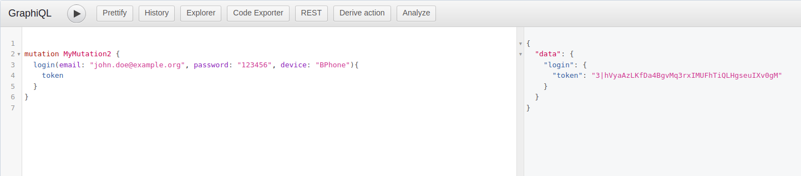

:::caution
Tài liệu này chỉ dành cho Laravel users sử dụng [webhook authentication](./01-webhook-authentication.mdx).
:::

[Laravel Sanctum](https://laravel.com/docs/8.x/sanctum) là một authentication system tuyệt vời và được cài đặt sẵn ở các 
kickstarter template của Laravel, tài liệu này sẽ hướng dẫn bạn dùng Sanctum để làm authentication system cho Hasura. 

## Mobile app authentication 

:::info
Nếu như project của bạn sử dụng [Laravel app](../02-installation/02-application-templates.md), template đã setup mọi thứ giúp bạn,
bạn không cần làm theo các bước bên dưới mà chỉ nên đọc để hiểu cơ chế hoạt động của nó như thế nào.
:::

### Cấu hình auth

Bạn cần thiết lập `defaults.guard` trong `config/auth.php` là `sanctum`:

```php title="config/auth.php"
'defaults' => [
    'guard' => 'sanctum',
],
```

Trong trường hợp project của bạn có multi guards và `defaults.guard` không thể là `sanctum` thì bạn hãy thêm nó vào `auth.guard` trong file `config/hasura.php`:

```php title="config/hasura.php"
'auth' => [
    'guard' => ['sanctum'],
]
```

:::info
Nếu `sanctum` không phải là `defaults.guard` thì khi bạn sử dụng hàm `auth()` cần explicit guard là `sanctum`:

```php
auth('sanctum')->user();
```
:::

### Thêm login mutation

Bạn cần thêm GraphQL login mutation để user có thể đăng nhập lấy token sử dụng cho các phiên sau, chúng ta sẽ sử dụng
[remote schema](../03-handle-business-logic/01-remote-schema.md) để thêm login mutation.

Ví dụ login mutation resolver:

```php title="app/Http/GraphQL/LoginMutation/Resolver.php"
<?php

namespace App\Http\GraphQL\LoginMutation;

use App\Models\User;
use Hasura\GraphQLiteBridge\Attribute\Roles;
use Hasura\Laravel\GraphQLite\Attribute\ArgModel;
use Illuminate\Support\Facades\Hash;
use TheCodingMachine\GraphQLite\Annotations as GQL;
use TheCodingMachine\GraphQLite\Exceptions\GraphQLException;
use TheCodingMachine\GraphQLite\Laravel\Annotations\Validate;

class Resolver
{
    #[GQL\Mutation(name: 'login')]
    #[ArgModel(for: 'user', argName: 'email', fieldName: 'email', inputType: 'String!')]
    #[Roles('anonymous')]
    public function __invoke(
        User $user,
        #[Validate(['rule' => 'required'])] string $password,
        #[Validate(['rule' => 'required'])] string $device
    ): Output {
        if (!Hash::check($password, $user->getAuthPassword())) {
            throw new GraphQLException('Invalid credentials', category: 'InvalidCredentials');
        }

        $output = new Output();
        $output->token = $user->createToken($device)->plainTextToken;

        return $output;
    }
}
```

Và `Output` type class:

```php title="app/Http/GraphQL/LoginMutation/Output.php"
<?php

namespace App\Http\GraphQL\LoginMutation;

use TheCodingMachine\GraphQLite\Annotations as GQL;

#[GQL\Type(name: 'login_output', default: true)]
class Output
{
    #[GQL\Field]
    public string $token;
}
```

Sau khi thêm bạn hãy [persist application state](../07-manage-metadata/07-persist-application-state.mdx) và hãy thử đăng nhập với kết quả mong đợi sẽ là:

