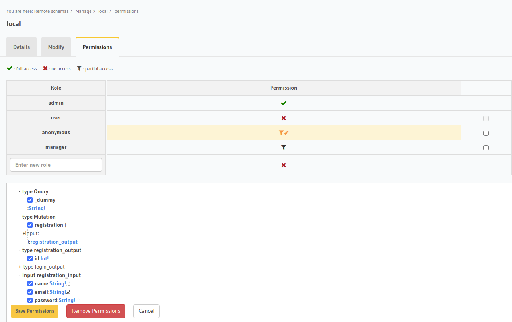
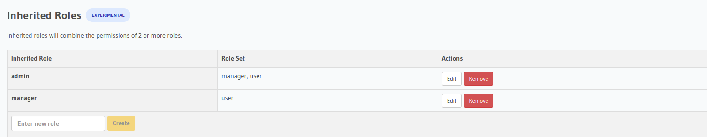
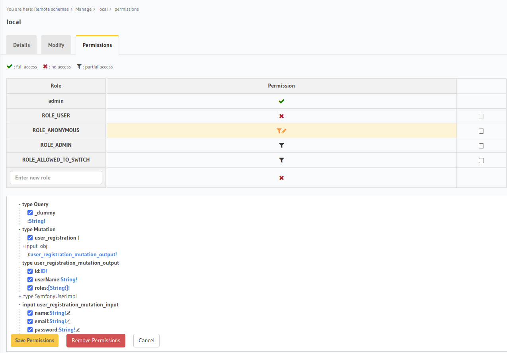
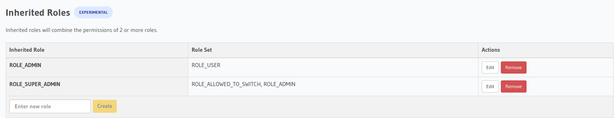

import Tabs from '@theme/Tabs';
import TabItem from '@theme/TabItem';

Persist application [state](https://en.wikipedia.org/wiki/State_(computer_science)) sẽ giúp việc đồng bộ cấu hình giữa application
của bạn với Hasura metadata (ví dụ: remote schema permissions roles, inherited roles, remote schema SDL), việc đồng bộ này sẽ giúp
đảm bảo tính consistent giữa application với Hasura.


Để persist application state bạn cần thực thi command sau:

<Tabs
groupId="frameworks"
defaultValue="laravel"
values={[
{label: 'Đối với Laravel users', value: 'laravel'},
{label: 'Đối với Symfony users', value: 'symfony'},
]}>
<TabItem value="laravel">

```shell
php artisan hasura:metadata:persist-state
```

Command trên sẽ persist application state giúp bạn.
</TabItem>
<TabItem value="symfony">

```shell
php bin/console hasura:metadata:persist-state
```

Command trên sẽ persist application state giúp bạn.
</TabItem>
</Tabs>

## Cách thức hoạt động

<Tabs
groupId="frameworks"
defaultValue="laravel"
values={[
{label: 'Đối với Laravel framework', value: 'laravel'},
{label: 'Đối với Symfony framework', value: 'symfony'},
]}>
<TabItem value="laravel">

Giả sử như application của bạn có mutation field `registration` dành cho `anonymous` như sau:

```php title="app/Http/GraphQL/RegistrationMutation/Resolver.php"
namespace App\Http\GraphQL\RegistrationMutation;

use App\Models\User;
use Hasura\GraphQLiteBridge\Attribute\Roles;
use Hasura\Laravel\GraphQLite\Attribute\ValidateObject;
use Illuminate\Support\Facades\Hash;
use TheCodingMachine\GraphQLite\Annotations as GQL;

class Resolver
{
    #[GQL\Mutation(name: 'registration', outputType: 'registration_output')]
    #[ValidateObject(for: 'input')]
    #[Roles('anonymous')]
    public function __invoke(Input $input): User
    {
        $user = new User();
        $user->name = $input->name;
        $user->email = $input->email;
        $user->password = Hash::make($input->password);
        $user->saveOrFail();

        return $user;
    }
}
```

và [inherited roles](../05-security/04-laravel-access-control.md#inherited-roles) như sau:

```yaml title="config/hasura.php"
'auth' => [
    'inherited_roles' => [
        'admin' => ['manager', 'user'],
        'manager' => ['user']
    ],
]
```

Để persist các application state trên lên Hasura metadata thì bạn cần thực thi Artisan console command sau:

```shell
php artisan hasura:metadata:persist-state
```

Sau khi persist xong ngay bây giờ bạn hãy thử kiểm tra lại application [remote schema permissions](https://hasura.io/docs/latest/graphql/core/remote-schemas/auth/remote-schema-permissions.html) trên Hasura sẽ thấy kết quả sau:



Và tiếp đến hãy thử kiểm tra [inherited roles](https://hasura.io/docs/latest/graphql/core/auth/authorization/inherited-roles.html) trên Hasura sẽ thấy kết quả sau:



Vậy là bạn đã hoàn tất việc persist application state lên Hasura rồi đấy.

</TabItem>
<TabItem value="symfony">

Giả sử như application của bạn có mutation field `user_registration` dành cho `ROLE_ANONYMOUS` như sau:

```php title="src/GraphQL/User/RegistrationMutation/Resolver.php"
namespace App\GraphQL\User\RegistrationMutation;

use App\Entity\User;
use App\Security\SystemRoles;
use Hasura\Bundle\GraphQLite\Attribute\ObjectAssertion;
use Hasura\Bundle\GraphQLite\Attribute\Transactional;
use Hasura\GraphQLiteBridge\Attribute\ArgNaming;
use Hasura\GraphQLiteBridge\Attribute\Roles;
use Symfony\Component\PasswordHasher\Hasher\UserPasswordHasherInterface;
use TheCodingMachine\GraphQLite\Annotations as GQL;

final class Resolver
{
    public function __construct(private UserPasswordHasherInterface $hasher)
    {
    }

    #[GQL\Mutation(name: 'user_registration', outputType: 'user_registration_mutation_output!')]
    #[Roles(SystemRoles::ROLE_ANONYMOUS)]
    #[ArgNaming(for: 'inputObj', name: 'input_obj')]
    #[ObjectAssertion(for: 'inputObj')]
    #[Transactional]
    public function __invoke(Input $inputObj): User
    {
        $user = new User();
        $user->setName($inputObj->name);
        $user->setEmail($inputObj->email);
        $user->setPassword($this->hasher->hashPassword($user, $inputObj->password));

        return $user;
    }
}
```

và [role hierarchy](https://symfony.com/doc/current/security.html#hierarchical-roles) như sau:

```yaml title="config/packages/security.yaml"
role_hierarchy:
    ROLE_ADMIN:       ROLE_USER
    ROLE_SUPER_ADMIN: [ROLE_ADMIN, ROLE_ALLOWED_TO_SWITCH]
```

Để persist các application state trên lên Hasura metadata thì bạn cần thực thi Symfony console command sau:

```shell
php bin/console hasura:metadata:persist-state
```

Sau khi persist xong ngay bây giờ bạn hãy thử kiểm tra lại application [remote schema permissions](https://hasura.io/docs/latest/graphql/core/remote-schemas/auth/remote-schema-permissions.html) trên Hasura sẽ thấy kết quả sau:



Và tiếp đến hãy thử kiểm tra [inherited roles](https://hasura.io/docs/latest/graphql/core/auth/authorization/inherited-roles.html) trên Hasura sẽ thấy kết quả sau:



Vậy là bạn đã hoàn tất việc persist application state lên Hasura rồi đấy.

</TabItem>
</Tabs>

